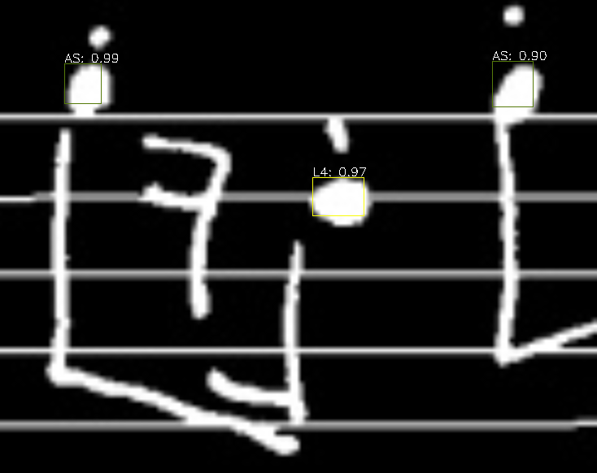

# MUSCIMA Notes Recognition

The aim of this project is to use Faster-RCNN to recognize notes position from the CVC-MUSCIMA dataset using MUSCIMA++ annotations.



## Steps to reproduce the experiments
Open a terminal in a desired folder
### 1) Download the source code of this project
`git clone https://github.com/StivenMetaj/DDM_MUSCIMA_Project.git`
### 2) Download MUSCIMA dataset
```bash
# enter in the project directory (we will refer to project directory with $PROJECT_ROOT):
cd DDM_MUSCIMA_Project
# create some directories:
mkdir -p data/CVCMUSCIMA/MUSCIMA++
# download the CVCMUSCIMA_WI dataset:
wget http://www.cvc.uab.es/cvcmuscima/CVCMUSCIMA_WI.zip
# extract it:
unzip CVCMUSCIMA_WI.zip -d data/CVCMUSCIMA
# download the CVCMUSCIMA_SR dataset:
wget http://www.cvc.uab.es/cvcmuscima/CVCMUSCIMA_SR.zip
# extract it:
unzip CVCMUSCIMA_SR.zip -d data/CVCMUSCIMA
# download MUSCIMA++ annotations:
curl --remote-name-all https://lindat.mff.cuni.cz/repository/xmlui/bitstream/handle/11372/LRT-2372{/MUSCIMA-pp_v1.0.zip}
# extract them:
unzip MUSCIMA-pp_v1.0.zip -d data/CVCMUSCIMA/MUSCIMA++
```
### 3) Convert dataset into COCO format
The conversion process consists into shredding original images into several patches and convert the ground truth in COCO format.
Dataset conversion is random (because of random patches) but reproducible by setting the seed at the top of the file conversion/convert_to_coco.py.<br>
For our experiments, we created the dataset using seed=0 and 128x128 patches size.

+ convert dataset into COCO format:
`python3 conversion/convert_to_coco.py`
+ at this time, you should have the following folder structure:

<pre>
.
├── conversion
│   ├── convert_to_coco.py
│   ├── convert_to_voc.py
│   ├── split.py
│   └── utils.py
├── data
│   ├── CVCMUSCIMA 
│   │   ├── CvcMuscima-Distortions
│   │   ├── CVCMUSCIMA_WI
│   │   └── MUSCIMA++
│   └── mnr
│       ├── annotations
│       ├── test2019
│       ├── train2019
│       └── val2019
├── maskrcnn-benchmark
└── README.md
</pre>

### 4) Prepare facebookreasearch/maskrcnn-benchmark library

+ follow the instructions to install the library in $PROJECT_ROOT/maskrcnn-benchmark/INSTALL.md
+ return to $PROJECT_ROOT
+ create a symbolic link to MUSCIMA dataset:
`ln -s data/mnr maskrcnn-benchmark/datasets/mnr`

### 5) Experiments
Inside the folder $PROJECT_ROOT/maskrcnn-benchmark/configs/muscima, we created two configuration files with all parameters needed to train and evaluate a Faster R-CNN with ResNet-50 backbone on MUSCIMA dataset (COCO format).
The only difference between the two configurations is that one of them specifies lo load weights from a ResNet-50 pretrained on ImageNet dataset before the training begins. 
#### Training
The following are the commands we used for training the two different nets:

```bash
# from $PROJECT_ROOT:
cd maskrcnn-benchmark
# train (non-pretrained net):
python3 tools/train_net.py --config-file configs/muscima/e2e_faster_rcnn_R_50_FPN_1x_muscima.yaml SOLVER.BASE_LR 0.0001 SOLVER.WEIGHT_DECAY 0.0002 SOLVER.IMS_PER_BATCH 16 SOLVER.MAX_ITER 100000 SOLVER.STEPS "(70000, 90000)" OUTPUT_DIR models/muscima/e2e_faster_rcnn_R_50_FPN_1x_muscima
# train (pretrained net):
python3 tools/train_net.py --config-file configs/muscima/e2e_faster_rcnn_R_50_FPN_1x_muscima_pretrained_imagenet.yaml SOLVER.BASE_LR 0.0025 SOLVER.WEIGHT_DECAY 0.0002 SOLVER.IMS_PER_BATCH 16 SOLVER.MAX_ITER 100000 SOLVER.STEPS "(55000, 70000,)" OUTPUT_DIR models/muscima/e2e_faster_rcnn_R_50_FPN_1x_muscima_pretrained_imagenet
```

Note: uppercase parameters are parameters for maskrcnn, and next to them there are the corresponding values.
These parameters are optional: first, default value for any parameter is loaded from $PROJECT_ROOT/maskrcnn-benchmark/maskrcnn_benchmark/config/defaults.py;
then, these values are overwritten with values in the configuration file; finally, values are overwritten with command-line input.

#### Evaluation
The script $PROJECT_ROOT/maskrcnn-benchmark/tools/evaluate_and_plot.py evaluates all checkpoints in a given directory, creating metrics comparison plots for different datasets.

```bash
# evaluate (non-pretrained net):
python3 tools/evaluate_and_plot.py --config-file "configs/muscima/e2e_faster_rcnn_R_50_FPN_1x_muscima.yaml" DATASETS.TEST "('muscima_train','muscima_val')"
# evaluate (pretrained net):
python3 tools/evaluate_and_plot.py --config-file "configs/muscima/e2e_faster_rcnn_R_50_FPN_1x_muscima_pretrained_imagenet.yaml" DATASETS.TEST "('muscima_train','muscima_val')"
```

The script also create metrics comparison plots for different variants (like pretrained or non-pretrained); a variant is identified by a folder which contains the corresponding checkpoints.

```bash
evaluate (non-pretrained vs pretrained):
python3 tools/evaluate_and_plot.py --output_dirs "models/muscima/e2e_faster_rcnn_R_50_FPN_1x_muscima,models/muscima/e2e_faster_rcnn_R_50_FPN_1x_muscima_pretrained_imagenet" DATASETS.TEST "('muscima_test',)" 
```

Note: training phase creates a file named last_checkpoint in OUTPUT_DIR folder, which is useful to restart training from the last checkpoint, but must be renamed or deleted to allow loading of previous checkpoints in that folder (we suggest to rename it for precaution).

## Our results
Evaluated metrics:

+ AD: Average Distance.
+ AP: mean Average Precision for IoU from 0.50 to 0.95 with a step size of 0.05.
+ AP50: Average Precision considering boxes having at least IoU equal to 0.50.
+ AP75: Average Precision considering boxes having at least IoU equal to 0.75.

The following plots refer to evaluation on the test set.

   

= 0.50"/> = 0.75"/> 

## Notes
Source codes of library maskrcnn-benchmark was downloaded (on 5 February 2019) and modified when necessary.
If you want to check or download the latest version of this library, you can find it here: https://github.com/facebookresearch/maskrcnn-benchmark.
If you have to use this project with a newer version of maskrcnn-benchmark, you can download it, replace the included version inside this project, install, and then redo the changes we made.

The main changes we made were to add the following files inside $PROJECT_ROOT/maskrcnn-benchmark:

+ configs/muscima/e2e_faster_rcnn_R_50_FPN_1x_muscima.yaml
+ configs/muscima/e2e_faster_rcnn_R_50_FPN_1x_muscima_pretrained_imagenet.yaml
+ demo/muscima_predictor_demo.py
+ maskrcnn_benchmark/config/paths_catalog.py
+ tools/evaluate_and_plot.py

Other minor changes we made were mainly to support the VOC format, but we recommend using the COCO format.
